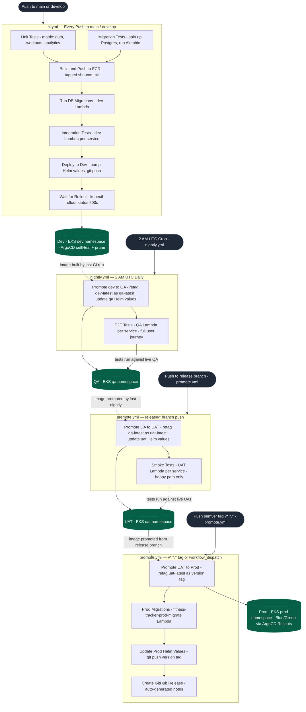

# CI/CD Pipeline

Rendered with [Mermaid](https://mermaid.js.org/) — visible natively on GitHub and in VS Code with the Mermaid Preview extension.

## How to promote between environments

| From → To | Trigger |
|---|---|
| Dev (every push) | Automatic — any push to `main` or `develop` |
| Dev → QA (nightly) | Automatic — cron at 2 AM UTC; or run `nightly.yml` manually via `workflow_dispatch` |
| QA → UAT | Push or merge to a `release/*` branch: `git checkout -b release/v1.1.0 && git push origin release/v1.1.0` |
| UAT → Prod | Push a semver tag: `git tag v1.1.0 && git push origin v1.1.0` — or trigger `promote.yml` manually with a version input |

## Test tier responsibilities

| Tier | Workflow | Runs on | What it checks |
|---|---|---|---|
| Unit | `ci.yml` | GitHub Actions runner | Pure logic, no I/O |
| Migration | `ci.yml` | GitHub Actions runner + Postgres container | Alembic up/down against a real schema |
| Integration | `ci.yml` | Dev Lambda + Dev RDS/SQS | Each service against its own infrastructure |
| E2E | `nightly.yml` | QA Lambda | Full user journey across all services |
| Smoke | `promote.yml` | UAT Lambda | Happy path only — confirm deploy succeeded |
